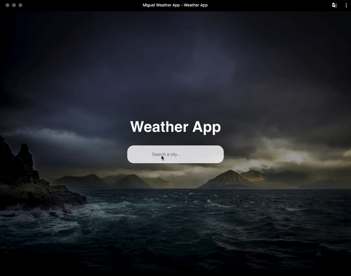
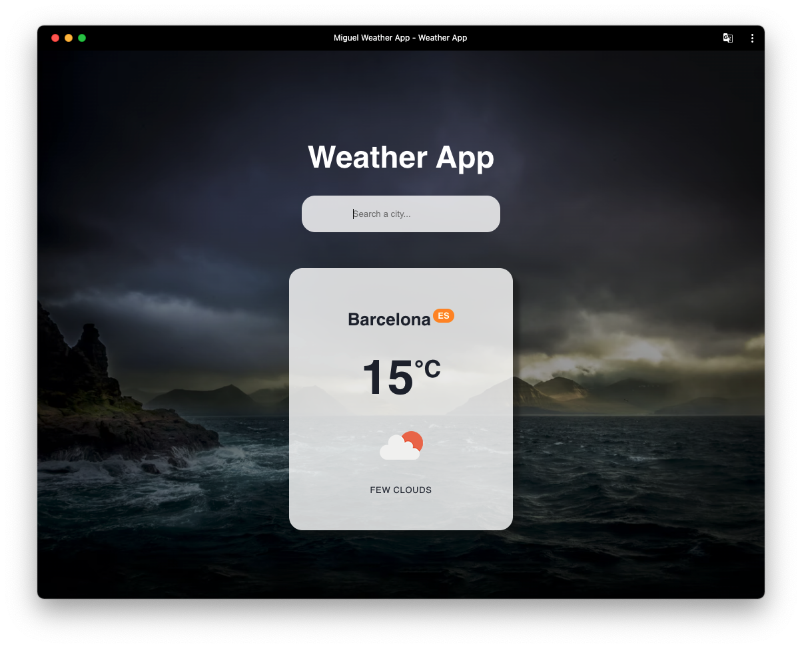

# Weather PWA App

This project is a Progressive Web App (PWA) that allows users to check the weather in different cities around the world using a text input. The purpose of this project is to learn and practice developing PWAs.

The app is developed using React JS and makes use of the OpenWeatherMap API to fetch the weather data.

## Features
+ Search for weather in any city around the world
+ View current weather conditions, including temperature and weather description
+ Responsive design that works on mobile and desktop

## Getting Started

To try the app locally, follow these steps:

1. Download or clone the project to your computer
2. Install the dependencies by running npm install in the project directory
3. Start the development server by running npm start
4. Visit localhost:3000 in your preferred browser

## Version History
### Version 1

In this version, users can search for the weather in any city around the world using the search bar. The search results display the current weather conditions, including temperature and weather description.
Future Versions

In future versions, we plan to add the following features:

+ Display weather forecast for upcoming days
+ Save favorite cities for quick access to weather information
+ Option to switch between Celsius and Fahrenheit units

## Contributing

Contributions are welcome! If you find a bug or have a feature request, please open an issue on the GitHub repository.
